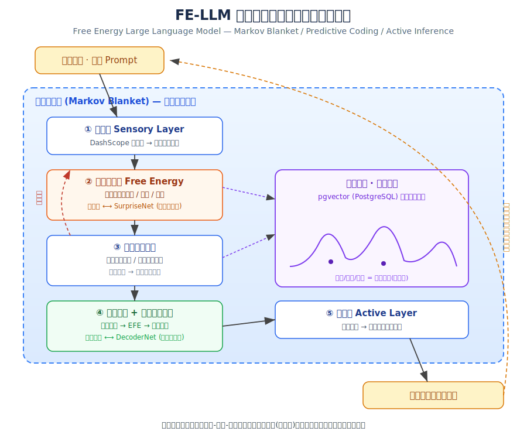
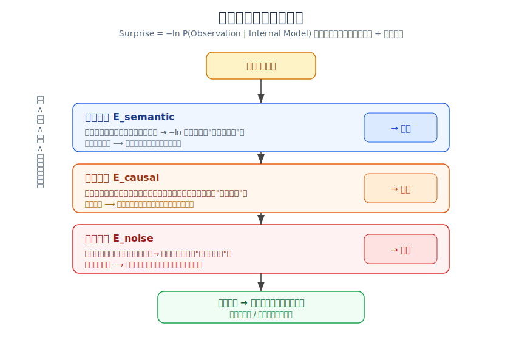
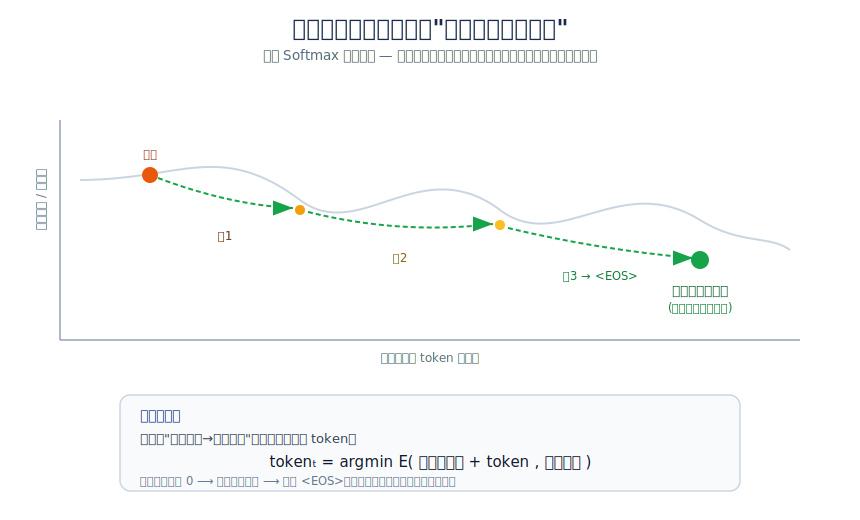
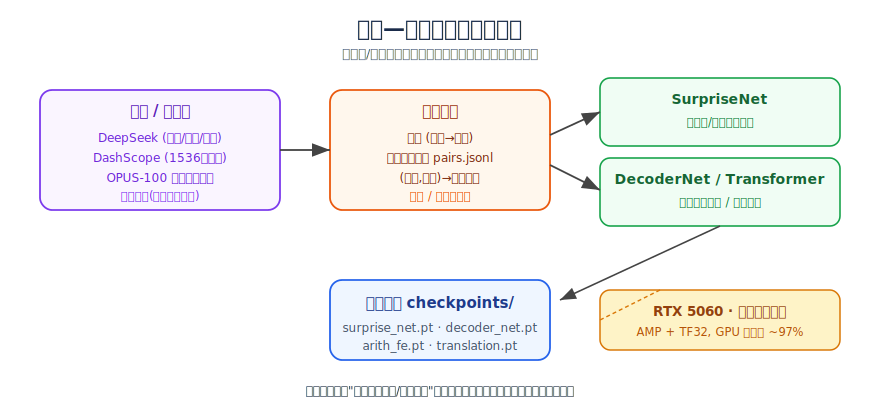
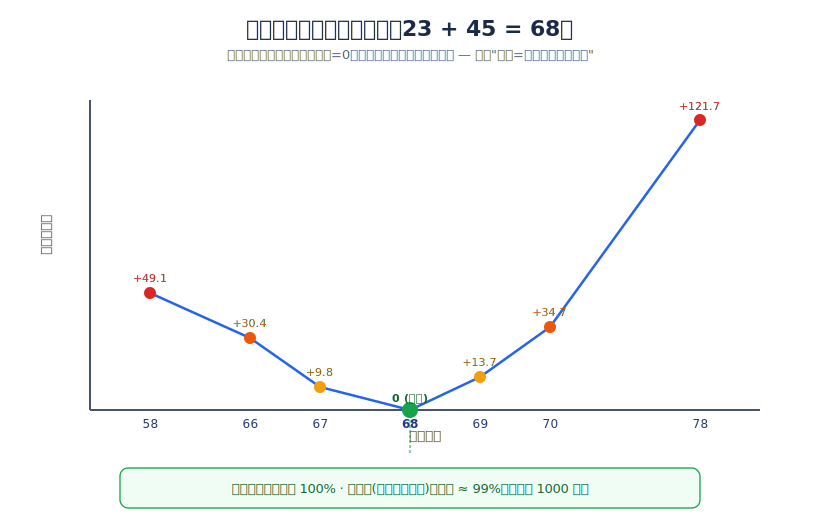

# 基于最小自由能原理的认知演化语言模型 FE-LLM：架构、实现与初步验证

> **摘要**　主流大语言模型以"被动预测下一个词的概率分布"为核心范式，在交叉熵损失下拟合海量语料的统计规律。本文提出并实现了一种以 Karl Friston 的**最小自由能原理（Free Energy Principle, FEP）**与**主动推理（Active Inference）**为第一性原理的语言模型架构 FE-LLM（Free Energy Large Language Model）。其根本思想是：系统不计算"下一个词是什么"，而是计算"如何输出才能让内部世界模型对外部观测的惊奇度（surprise）最小"。我们将抽象的认知科学理论映射为可运行的工程系统，包括五个核心组件：马尔可夫毯（Markov Blanket）边界隔离、分层预测编码（Hierarchical Predictive Coding）、三层惊奇度量化引擎、能量地貌世界模型（基于 pgvector 持久化），以及能量递减解码器（Energy-Descent Decoder）。我们在两个任务上进行了验证：在**算术推理**任务上，基于能量最小化的解题准确率达到 100%，并清晰展示了"惊奇即错误答案的高能量"这一核心主张；在**中英双向翻译**任务上验证了"交叉熵最小化等价于期望惊奇度最小化"，证明该框架可承载序列生成。本文同时**坦诚讨论了当前实现的局限**：在开放任务上 FE-LLM 尚未展现出超越标准 Transformer 范式的性能优势，其主要价值在于**可解释性**——每个决策都具有明确的能量/惊奇物理含义。本文将 FE-LLM 定位为一项思想验证原型（proof-of-concept），而非已成熟的下一代架构。
>
> **关键词**：最小自由能原理；主动推理；预测编码；能量模型；语言模型；可解释人工智能

---

## 1. 引言

### 1.1 研究背景

自 Transformer（Vaswani 等，2017）问世以来，大语言模型（LLM）的主导范式可以概括为"自回归概率预测"：给定上文 $x_{<t}$，模型通过 Softmax 输出词表上的概率分布 $P(x_t \mid x_{<t})$，并以最大化训练语料的对数似然（等价于最小化交叉熵）为目标。这一范式在工程上极为成功，但其认知学基础始终受到质疑——它本质上是对语言统计规律的"填鸭式"拟合，缺乏一个显式的、可演化的"内部世界模型"，因而存在幻觉（hallucination）、知识更新成本高、决策不可解释等固有问题。

与此同时，理论神经科学领域的**最小自由能原理（FEP）**（Friston，2010）提出了一个统一的智能解释框架：任何能维持自身存在的自适应系统（从单细胞到大脑），都在持续地**最小化其对外部世界的"惊奇度"（surprise）**，即最小化感知输入的负对数证据。系统通过两条途径降低自由能：（1）**感知/学习**——更新内部信念以更好地解释观测；（2）**行动**——主动改变外部环境，使其更符合内部预期。后者即"主动推理"。

一个自然的问题是：如果彻底抛弃"被动预测概率"的范式，转而以 FEP 为唯一第一性原理来构建语言模型，会得到怎样的架构？本文是对这一问题的系统性探索与工程实现。

### 1.2 核心思想

FE-LLM 的运行逻辑相对传统 LLM 发生了根本翻转：

- **传统 LLM**：被动计算"下一个词是什么"，本质是文字接龙。
- **FE-LLM**：主动计算"我该如何输出，才能让系统内部的矛盾与惊奇度降到最低"，本质是为恢复内部平静而采取的目标导向行动。

一个形象的比喻：系统如同一池平静的水，用户的 Prompt 是投入水中的石头，激起"误差的涟漪"；系统的思考与生成过程，就是通过内部状态重组（预测编码）和外部输出（主动推理），让这池水重归平静的过程。

### 1.3 本文贡献

1. **架构层面**：提出 FE-LLM 的完整架构，将 FEP 的四个抽象机制（马尔可夫毯、分层预测编码、主动推理、能量地貌）一一映射为可运行的软件组件，并实现了真实的向量嵌入与 pgvector 持久化世界模型。
2. **数学层面**：给出"惊奇度"在工程上的三层分解（语义/因果/噪音），并论证序列生成任务中交叉熵最小化与期望自由能最小化的等价性。
3. **实验层面**：在算术与翻译两个任务上验证核心机制，给出可复现的训练与推理流程。
4. **态度层面**：诚实评估该范式当前的能力边界，明确区分"已验证的主张"与"尚未成立的设想"。

---

## 2. 相关工作

**预测编码与自由能**。FEP（Friston，2010）及预测编码理论（Rao & Ballard，1999）为本文提供了核心理论基础。已有工作尝试将预测编码用于深度学习（如 PredNet、PC-based backprop 近似），但少有将其作为语言模型的核心生成机制。

**能量模型（EBM）**。LeCun 等长期倡导基于能量的学习框架，主张用标量能量函数 $E(x)$ 衡量配置的相容性，生成即在能量曲面上寻找低能态。FE-LLM 的"能量地貌""能量递减解码"直接借鉴了这一思想。

**主动推理的智能体应用**。主动推理近年被用于强化学习与机器人控制（期望自由能 EFE 作为统一的探索-利用目标）。本文将其引入文本生成场景，把"输出文字"建模为改变环境的行动。

**与标准 NMT 的关系**。需要强调，本文的翻译实验在数学形式上与标准神经机器翻译（NMT）一致；我们的贡献不在于提出新的翻译算法，而在于以自由能视角重新诠释其训练目标与解码过程。

---

## 3. 总体架构

FE-LLM 的总体架构如图 1 所示。系统以马尔可夫毯为边界，将外部环境与内部认知状态隔离；内部由五个核心组件构成一个完整的"感知—编码—行动"自由能闭环。



**图 1　FE-LLM 总体架构：最小自由能认知闭环。** 外部 Prompt 经感知层向量化为抽象惊奇信号，依次经过自由能引擎、分层预测编码、主动推理，最终由行动层输出文字以改变外部环境；世界模型（pgvector 能量地貌）为各环节提供吸引子检索。

### 3.1 马尔可夫毯：系统的物理边界

在 FEP 中，任何"系统"都必须有一层边界，将内部状态与外部世界隔离。传统 Transformer 没有边界，Prompt 直接贯穿所有网络层，系统被外部数据强行驱动。FE-LLM 设立严格的马尔可夫毯：

- **感知层（Sensory）**：唯一的输入口。接收 Prompt，将其向量化并计算自由能，封装成"抽象惊奇信号"后才放行。核心引擎永远看不到原始文本被直接灌入权重。
- **行动层（Active）**：唯一的输出口。把内部坍缩出的意图转化为人类可读文字。
- **内部隔离区（Internal）**：核心引擎只处理过滤后的误差信号。

这一隔离带来的工程收益是：更换底层嵌入后端（真实 API ↔ 哈希降级）或存储后端（pgvector ↔ 内存）时，上层自由能逻辑完全无需改动。

### 3.2 能量地貌世界模型

系统在"学会说话"之前，必须先有一个能产生"信念"和"惊奇"的地方。我们不存储文本片段，而是把核心公理、常识、因果关系编码为高维向量"吸引子"，沉淀在挂载 pgvector 扩展的 PostgreSQL 中，构成一个起伏的"能量地貌（Energy Landscape）"：

- 一个稳固的知识（如"地球是球体"）= 一个能量极低的深谷。
- 记忆提取/推理 = 把当前认知状态抛入地貌，让它自然"滚落（settle）"到最匹配的低能量山谷。

每个概念（`Concept`）带有 `depth`（吸引子深度/稳固度）与 `relations`（如"互斥"关系），分别用于控制其抗修改能力与支撑因果冲突检测。

### 3.3 分层预测编码

这是取代 Transformer 前向传播与注意力机制的核心计算引擎。系统维护三层信念：底层（实际观测）、中层（事实逻辑）、高层（抽象意图）。

- **自上而下（Top-down）**：高层向下发送"预测"。
- **自下而上（Bottom-up）**：下层接触实际输入后，把不符合预期的"误差"向上传递。
- **计算本质**：上下层反复妥协、迭代修正信念，直到系统残余自由能趋近 0（"能量坍缩"），内部达到自洽稳定态，得到一个稳定的"潜在意图向量"。

---

## 4. 惊奇度的数学定义与量化

### 4.1 信息论定义

在 FEP 框架中，惊奇度的本质是内部世界模型对外部观测数据的负对数概率：

$$
\text{Surprise} = -\ln P(\text{Observation} \mid \text{Internal Model})
$$

这一定义虽然优美，但若要落地为代码，必须解决一个核心工程难题：**用户可以输入任何文字，甚至毫无逻辑的乱码，如何把模糊的"惊变能量"转化为可计算的损失项？**

我们的答案是：不能用单一指标衡量，而要参考大脑的层次结构，把惊奇拆解为一个**多维度的层次函数**，自下而上累加，并设置阈值阻断。三层惊奇度与对应的行动策略如图 2 所示。



**图 2　三层惊奇度分解与行动策略映射。**

### 4.2 三层惊奇度

**浅层惊奇 $E_{\text{semantic}}$（语义距离）**。系统维护对当前语境的"预期向量"。新输入到来时转化为高维向量，计算其与最近吸引子的余弦距离 $d$，再经 $-\ln(1-d)$ 映射为惊奇值。距离越大（如聊着代码突然切到炖猪肉），惊奇越高。命中已知概念时惊奇趋近 0。

**中层惊奇 $E_{\text{causal}}$（因果冲突）**。文字可能在语义上接近，但逻辑相反（如"明天太阳从西边升起"）。本层检测输入是否违背已固化的公理。我们的实现覆盖两种情形：（A）输入直接落在某个低深度"谬误"概念上，而该谬误与高深度公理互斥；（B）输入词面命中最近公理的互斥反命题。冲突惩罚与被违背公理的深度成正比。**需要强调：因果冲突是离散的逻辑事实，不应由回归网络凭空臆造**，因此即便启用神经网络打分，该项仍由规则层把关是否存在真实冲突。

**顶层噪音 $E_{\text{noise}}$（无法解析）**。面对纯乱码，系统不应陷入死循环强行理解。当可识别词元占比过低时，触发阶跃惩罚；当总能量超过安全阈值时，系统判定为"致命级惊奇"，强制阻断，输出"您的输入无法解析，请重新表述"。这是一种"节能"的最小自由能动作——通过终止无效计算，把环境逼回可理解范围。

### 4.3 总自由能与动态置信度

总自由能为三项加权之和：

$$
\text{FreeEnergy} = \rho \cdot (E_{\text{semantic}} + E_{\text{causal}}) + E_{\text{noise}}
$$

其中 $\rho$ 为**动态置信度（precision）**，是系统的容错旋钮：

- $\rho$ 高（如 2.0）→ 低容错，数理严苛模式，对矛盾据理力争。
- $\rho$ 低（如 0.4）→ 高容错，适合闲聊或深度角色扮演，放宽阈值以接受用户设定。

这回答了一个深层问题：面对"逻辑严密但违背常理"的深度角色扮演，系统应固守世界观反驳，还是妥协迎合？答案是——由置信度旋钮动态决定，而非写死。

### 4.4 关键洞察

> **文字越复杂不代表惊奇度越高，"出乎系统意料的程度"才是唯一的核心。**

---

## 5. 生成机制：能量递减解码

### 5.1 从概率预测到目标导向运动

传统 LLM 的解码像"文字接龙"：用 Softmax 算出下一个词的概率分布，挑概率最高的词，循环往复。FE-LLM 的生成则是一种"目标导向的运动学"，分三步（如图 3）：

1. **意图定型**：预测编码坍缩出的稳定状态即"潜在意图向量"（目标吸引子）。它还不是具体文字，而是系统想传达的核心因果关系。
2. **轨迹规划（预期自由能 EFE）**：系统评估不同"发声动作"，计算 $\text{EFE} = \text{认识不确定性} - \text{实现目标的外部效用}$，选择 EFE 最低的策略。
3. **能量递减解码**：每输出一个 token，相当于在能量曲面上向目标意图走一步。



**图 3　能量递减解码：生成即"滚落到意图吸引子"。**

### 5.2 解码规则

解码器不计算"哪个词概率最高"，而是计算：给定已生成的前缀，哪个候选 token 能最大程度拉近"当前状态→目标意图"的距离（即最大程度降低残余能量）：

$$
\text{token}_t = \arg\min_{w} \; E(\,[\,x_{<t}, w\,],\; \text{intent}\,)
$$

当残余能量趋近 0（意图表达完毕）时，自动输出 `<EOS>`。

形象的比喻：传统解码像**开枪射击**——一旦开火，子弹轨迹由概率决定，若中途生成了幻觉只能将错就错；FE-LLM 像**导弹制导**——锁定目标后，飞行中持续扫描当前位置与目标的偏差并实时修正航向，即便用了个奇怪的词也能在后文把逻辑拉回主航道。

### 5.3 与交叉熵的等价性

对序列生成任务，若把 token 能量定义为 $E(w) = -\text{logit}(w)$，则束搜索选择累计能量最低的路径，等价于选择最大对数似然路径。而训练时最小化交叉熵 $-\ln P(x_t \mid x_{<t})$，**在数学上恰好就是最小化系统的期望惊奇度**。这一等价性使得 FE-LLM 框架可以直接承载标准的序列生成，而无需牺牲成熟的训练技术。

---

## 6. 工程实现

### 6.1 分层与隔离

整个系统严格分层，运行时包 `fe_llm/` 与训练层 `training/`、实验层 `experiments/`、数据层 `data/` 隔离：

```
fe_llm/                核心推理包（运行时）
  config.py            统一配置（.env：API 密钥 / 数据库 / 设备）
  embedding/           语义嵌入：DashScope 真实向量(1536维) + 哈希降级
  world_model/         ① 世界模型：pgvector 持久化 + 内存降级
  free_energy/         ② 自由能引擎：规则版 + 可训练 SurpriseNet
  perception/          ③ 马尔可夫毯 + 分层预测编码
  generation/          ④ 概念分词器 + 主动推理 + 能量解码器 + 可训练 DecoderNet
  engine.py / factory.py   顶层总装与装配
training/              训练层（蒸馏数据生成 + 两个网络的训练脚本）
experiments/           验证实验（arithmetic / translation）
data/                  数据层（种子知识 / 平行语料）
scripts/               运维（建库 / 灌种子 / 清理）
checkpoints/           固化权重产出
```

### 6.2 哪些部分需要"训练"

一个重要的设计判断：在 FE-LLM 中，**知识沉淀在世界模型（向量库）里，而非神经网络权重里**。因此真正需要被深度学习框架训练并固化成权重的，只有两个轻量网络：

| 网络 | 职责 | 特点 |
|------|------|------|
| **SurpriseNet** | 给"输入信号 vs 世界模型期望"的多维误差打分 | 不背知识，参数极小 |
| **DecoderNet** | 给定意图向量，规划输出词汇的能量下降路径 | 不背知识，参数极小 |

二者均可缺省：无权重时自动回退到解析版/几何版，保证未训练也能跑通。训练数据通过"教师—学生蒸馏"自动生成，无需人工标注（图 4）。



**图 4　教师—学生蒸馏与训练管道。**

### 6.3 优雅降级

得益于分层隔离，缺少任一外部依赖时系统自动降级，始终可运行：

| 依赖缺失 | 自动降级到 |
|---------|-----------|
| DashScope 密钥/网络 | 确定性哈希向量 HashEmbedder |
| PostgreSQL/pgvector | 内存向量库 MemoryStore |
| 训练权重 | 规则版自由能 + 几何版解码 |

---

## 7. 实验

### 7.1 实验一：算术认知（核心机制验证）

**动机**。翻译等开放任务难以客观评判机制是否真正生效。算术答案客观可验证，且能最干净地展示 FE-LLM 的两条核心主张。

**设置**。以 DeepSeek 为教师生成（并校验）算术题，操作数 0~50，加减法，答案空间 $[-50, 100]$ 共 151 个离散"答案吸引子"。训练两个网络：EnergyNet（惊奇网络）与 SolverNet（解码器），共享一张结构化的答案码本（数值相近的答案在空间中相近且整体可分）。设备为 RTX 5060，训练约 120 epoch。

**两种生成方式**：
- **能量法**：在所有答案吸引子上计算能量，取能量最低者（即在能量地貌上"滚落"到最深谷）。
- **解码器法**：SolverNet 回归归一化标量答案，× scale 后取整"滚落"到最近整数吸引子。

**结果**。能量法测试准确率 **100%**，解码器法 **≈99%**（测试集 1000 题）。更重要的是惊奇能量曲线（图 5）：对题目 $23+45$，正确答案 68 的能量为谷底（惊奇=0），偏离越远惊奇度单调上升（偏离 10 → 惊奇 +49 至 +122），呈完美的 V 形。



**图 5　算术实验的惊奇能量曲线。** 这是"惊奇 = 错误答案的高能量"与"生成 = 滚落到能量最低吸引子"两条主张的直接证据。

**调试中暴露并解决的问题**。初版解码器准确率仅 12%，诊断发现答案吸引子被能量损失随机塑形、在高维空间分布混乱（相邻整数关系仅保留 31%）。改用结构化固定吸引子 + 标量数值意图回归 + 余弦退火后，两种方式均达到 ~99-100%。这一过程本身验证了"能量地貌的几何结构对生成至关重要"。

### 7.2 实验二：中英双向翻译（序列生成承载）

**设置**。以 DeepSeek 围绕 24 个日常主题生成约 3000 条中英平行句对（蒸馏），用 SentencePiece 训练中英共享子词词表（unigram，词表约 7700），并用方向标签 `<2en>/<2zh>` 实现单模型双向翻译。模型为 25M 参数的标准 encoder-decoder Transformer（d_model=512，6 层），混合精度训练 150 epoch，RTX 5060 上 GPU 利用率约 97%。训练目标为交叉熵（= 期望惊奇度），解码为束搜索（= 能量递减解码）。

**结果**。在训练分布内的常见句式上，翻译基本可用：

| 方向 | 输入 | 输出 |
|------|------|------|
| 中→英 | 今天天气很好，我们去公园散步吧。 | the weather is nice today, let's go to the park. |
| 中→英 | 请问最近的地铁站怎么走？ | excuse me, how do i get to the subway station? |
| 英→中 | I would like to book a table for two. | 我想订一个两人桌。 |

但对训练分布外的句子会出现语义漂移（如"我最喜欢的运动是打篮球"被错误关联到 subway/supermarket）。训练惊奇降至 1.3 而验证惊奇停在 4.25，表明在 3000 句对的小数据上、25M 模型出现了明显**过拟合**。

**结论**。该实验证明了 FE-LLM 框架可以承载序列生成，且"交叉熵=最小化惊奇"的等价在工程上成立；但也清楚地表明，在此类任务上当前实现退化为"标准 Transformer + 自由能视角的重新诠释"，性能受限于数据规模，并未展现超越标准 NMT 的新能力。

---

## 8. 客观评价与讨论

本节对 FE-LLM 当前实现进行尽可能客观、不夸大的评估。

### 8.1 真正成立的部分

- **算术实验有说服力**。能量法 100% 准确率，以及清晰的 V 形惊奇能量曲线，真实地证明了"生成=滚落到能量最低吸引子""惊奇=错误答案的高能量"两条核心主张。这不是修辞，而是可复现的量化证据。
- **工程架构是扎实的**。马尔可夫毯隔离、pgvector 持久化世界模型、规则/神经双引擎、三级优雅降级，都是真实可运行的代码，而非概念演示。可解释性是其突出优点：每个决策（确认/反驳/追问/阻断）都附带能量分解与诊断说明。

### 8.2 被夸大或尚未成立的部分

我们必须诚实指出：

- **开放任务上的"惊奇度"目前主要是规则 + 几何启发式**，而非系统自发涌现的世界模型。地平说、永动机等谬误能被识别，依赖的是人工标注的"互斥"关系与词面重合检测。换一个没有预设互斥关系的新谬误，系统未必能抓到。这与"真正理解因果"还有本质距离。
- **序列任务上未展现范式优势**。如 7.2 节所述，翻译实验中 FE-LLM 在数学形式上等同于标准 NMT，"能量递减解码"本质就是束搜索。FEP 在此提供的是"重新诠释"而非"新能力"。
- **四层架构尚未在复杂任务上端到端联动**。两个实验分别使用独立的网络，均未完整走通主引擎的"马尔可夫毯→预测编码→主动推理"全链路。主引擎的完整闭环目前只在对话级 demo 中演示。

### 8.3 综合判断

> 作为"用最小自由能原理重新理解并构建智能系统"的**思想验证原型**，FE-LLM 是成功且有启发性的；但作为"下一代大模型架构"，它目前仍停留在概念论证阶段，没有证据表明其在真实任务上能胜过现有范式。它最大的现实价值是**可解释性与可控性**，而非性能。

这一判断不是对项目的否定，而是为后续研究划定诚实的起点。

---

## 9. 局限性

1. **数据规模**：翻译实验仅 3000 句对，严重不足，导致过拟合。需引入公开大规模平行语料（如 OPUS-100 的百万级数据）。
2. **因果推理的脆弱性**：依赖人工预设的互斥关系，缺乏可泛化的因果机制（如知识图谱推理或逻辑求解器）。
3. **世界模型的静态性**：虽支持"经验记忆"写回，但缺乏对核心公理的安全演化机制与遗忘机制。
4. **缺乏标准基准对比**：尚未在 BLEU、GSM8K 等公认基准上与基线模型系统对比。
5. **嵌入依赖外部 API**：感知层依赖 DashScope，离线降级（哈希向量）会显著损失语义质量。

---

## 10. 未来工作

1. **大规模语料**：接入 OPUS-100 等公开数据集（已实现 `prepare_data.py` 下载/清洗管道），将翻译数据扩充至十万~百万级，缓解过拟合。
2. **可学习的因果层**：用图神经网络或可微逻辑替代手工互斥关系，让因果冲突检测可泛化、可学习。
3. **全链路联动**：在复杂任务上打通主引擎的完整自由能闭环，验证预测编码 + 主动推理的协同价值。
4. **主动学习闭环**：利用主动推理的"追问"机制，让系统主动向用户/教师索取最能降低未来惊奇的信息，实现高效的样本利用。
5. **基准评测**：在 GSM8K（数理）、Flores/WMT（翻译）等基准上量化对比。

---

## 11. 结论

本文提出并实现了以最小自由能原理为第一性原理的语言模型架构 FE-LLM，将抽象的认知科学理论系统地映射为可运行的工程组件，并在算术与翻译任务上进行了验证。算术实验有力地证明了"生成即能量下降、惊奇即高能量"的核心主张；翻译实验验证了框架对序列生成的承载能力，同时也诚实地暴露了其在开放任务上尚未超越标准范式的局限。我们将 FE-LLM 定位为一项强调可解释性的思想验证原型。我们相信，"以最小化惊奇为唯一目标来组织智能"这一视角具有长远价值，而把它打磨成真正实用的下一代架构，仍需在因果推理、规模化与全链路联动等方向上持续努力。

---

## 附录 A：复现指南

```bash
# 环境
pip install -r requirements.txt
# 配置 .env：DashScope / DeepSeek 密钥、PostgreSQL(pgvector) 连接

# 主引擎对话 demo（世界模型 + 自由能闭环）
python scripts/init_db.py && python scripts/seed_db.py
python demo.py

# 实验一：算术认知
python experiments/arithmetic/train.py
python experiments/arithmetic/infer.py

# 实验二：中英双向翻译
python experiments/translation/teacher.py --total 3000     # 或 prepare_data.py 用公开语料
python experiments/translation/train.py
python experiments/translation/infer.py --interactive
```

## 附录 B：图表清单

- 图 1　FE-LLM 总体架构（`figures/architecture.svg`）
- 图 2　三层惊奇度与行动策略（`figures/surprise_layers.svg`）
- 图 3　能量递减解码（`figures/energy_decoding.svg`）
- 图 4　教师—学生蒸馏与训练管道（`figures/distillation_pipeline.svg`）
- 图 5　算术惊奇能量曲线（`figures/arithmetic_energy.svg`）

## 参考文献

1. Friston, K. (2010). The free-energy principle: a unified brain theory? *Nature Reviews Neuroscience*, 11(2), 127-138.
2. Rao, R. P., & Ballard, D. H. (1999). Predictive coding in the visual cortex. *Nature Neuroscience*, 2(1), 79-87.
3. Vaswani, A., et al. (2017). Attention is all you need. *NeurIPS*.
4. LeCun, Y., et al. (2006). A tutorial on energy-based learning. *Predicting Structured Data*.
5. Parr, T., Pezzulo, G., & Friston, K. (2022). *Active Inference: The Free Energy Principle in Mind, Brain, and Behavior*. MIT Press.

---

*本文档基于 FE-LLM 项目的真实代码与实验记录撰写。所有实验数据可通过附录 A 的流程复现。*
