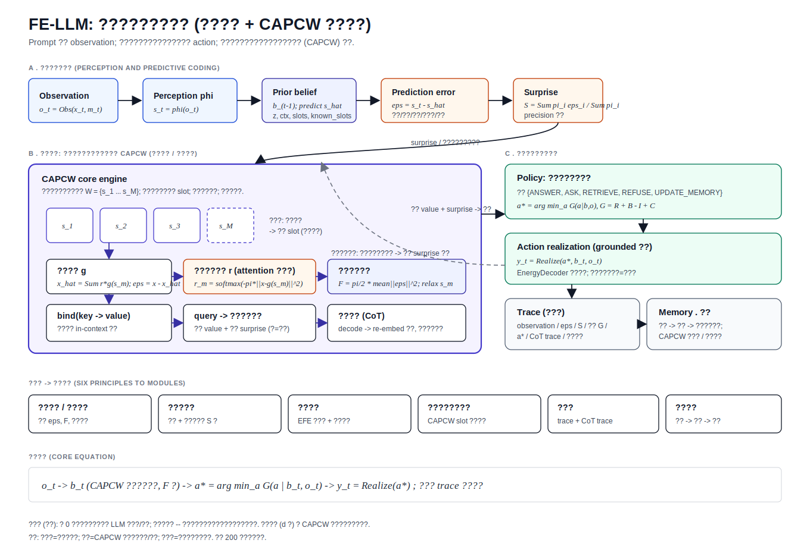
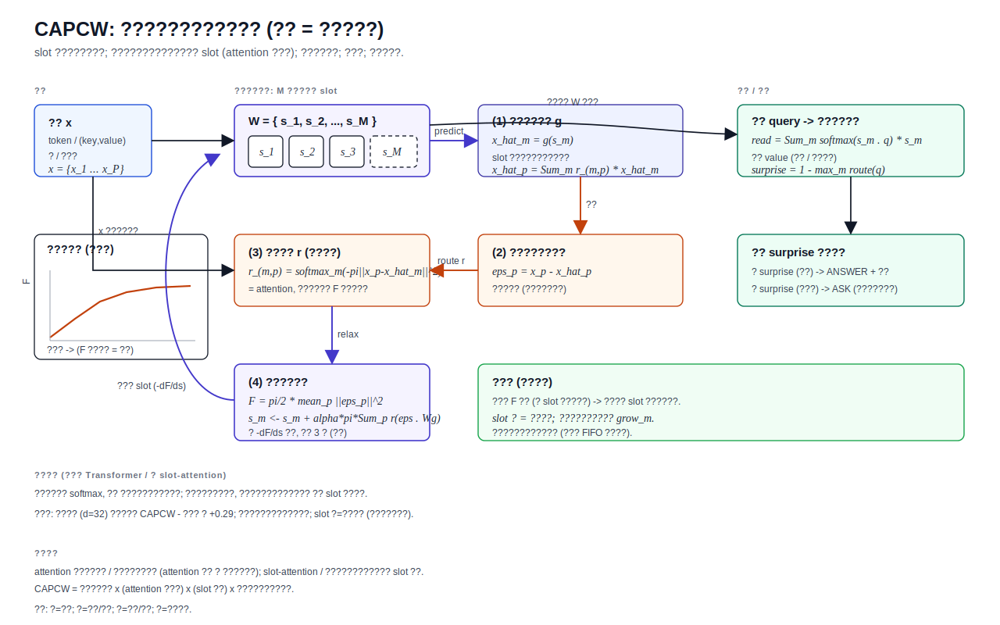
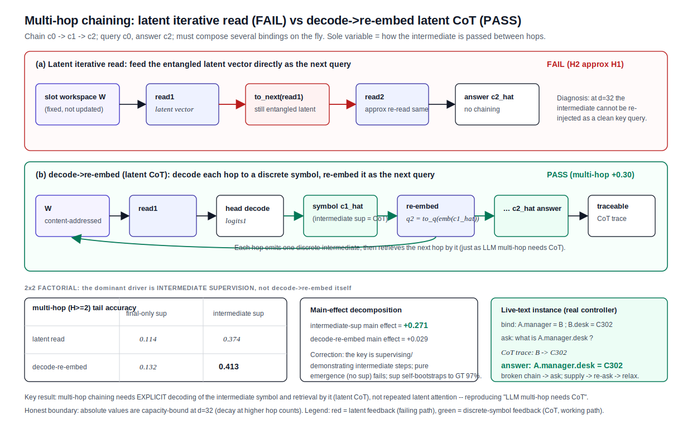
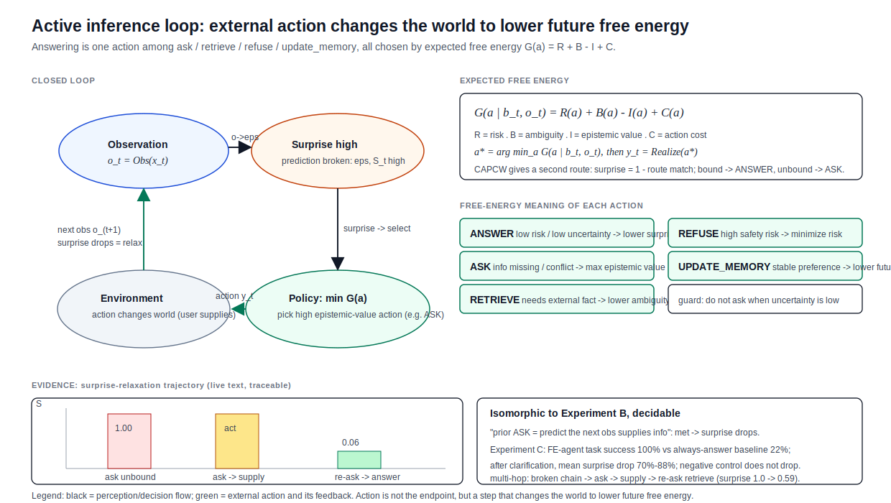

# FE-LLM：一种可溯源的主动推理语言架构与内容寻址预测编码核心引擎

> **摘要**　主流大语言模型把生成建模为条件语言建模：给定上下文逐 token 估计 `P(y_t mid y_{<t}, x)`，再采样或搜索。这一路线工程上极成功，但通常不显式回答三个问题：输入如何扰动模型的内部世界状态？模型为何选择回答、追问、检索、拒答或记忆更新？输出能否被追溯为一次降低不确定性的行动？本文报告 **FE-LLM**：一个**从 0 自建、不依赖预训练底座**、以自由能最小化 / 预测编码 / 主动推理为组织原则的语言架构，分两部分：(1) 一个已端到端打通并在真实任务对话数据上验证的**主动推理控制闭环**——把 prompt 视为 observation，先估计相对当前 belief 的 prediction error 与 surprise，再在候选动作间最小化期望自由能，最后把动作实现为可溯源的语言输出；(2) 一个我们提出并系统验证的**核心引擎 CAPCW（内容寻址预测编码工作空间）**——把自由能 / 预测误差从失败的"固定纵向分层"搬到 Transformer 已验证有效的"横向、内容寻址"结构上，并补上"可溯源 + 可生长"。CAPCW 把世界状态表示为一组可寻址 slot，误差按内容路由到 slot（attention 即推理），弛豫降自由能，穷则变生长。我们以"先定任务与判据、再写引擎"的纪律给出一系列单变量、同预算的判定实验：内容寻址绑定在容量受限区间决定性胜单向量；序列相邻算子救活 induction；**多跳链式推理的关键是显式解码中间符号再据它检索（潜在思维链 / CoT），而非潜空间反复 attention**（独立复现"LLM 多跳要 CoT"）；2×2 析因进一步把多跳主因定位为"中间监督"，且该监督可由单跳 teacher 自举；引擎 surprise 让"知道何时不该答 + 内容取回 + 多步推理"接回真实 controller 的活文本路径并从机制涌现。我们同样诚实地报告负结果与边界：分层世界模型经组合泛化裁决判为本规模过度设计、已封存；CAPCW 不解锁比较 / 计数这类运算推理（它是内容寻址工作记忆引擎，非通用算术聚合器）；裸增容量 d 不抬反降（须架构工程才能 scale，等于重建标准大模型，按容量纪律刻意不走）。全量 **200 个回归测试**守护可复现性。本文把语言生成重新定义为**可追踪的主动推理行动**，把"powerful brain"的核心引擎问题从"分层不是答案"推进到"CAPCW 是边界清晰的正面答案"。
>
> **关键词**：主动推理；自由能原理；预测编码；内容寻址；注意力即推理；可溯源生成；思维链；自我成长；能量模型

---

## 1. 引言

### 1.1 从"预测下一个词"到"平复惊奇"

Transformer 以来，语言模型的标准形式是

$$
y_t^\star=\arg\max_{w} P_\theta(w\mid x,y_{<t}).
$$

它极有效，但若目标是一种**可溯源、能主动思考、能自我成长**的语言系统，仅靠 next-token prediction 会留下理论空缺：模型为什么要说这句话？为什么现在应该回答而不是追问？为什么某些输入应触发检索、拒答或记忆更新？

FE-LLM 的出发点是：

> 用户输入不是一段等待续写的文本，而是一次对模型内部世界稳定态的扰动。生成不是单纯续写，而是系统为降低当前与未来自由能而采取的外部行动。

因此 FE-LLM 的核心问题不是"下一个 token 是什么"，而是"当前 observation 打破了哪里？哪种 action 最能降低期望自由能？"

### 1.2 两个层次与两条贡献线

FE-LLM 有两个层次（图 1）：

1. **控制架构（control architecture）**：感知 → 预测误差 / surprise → 期望自由能策略 → 行动实现 → 可溯源 trace / 成长。这一层已端到端打通，并在真实任务对话数据上证明价值。
2. **核心引擎（core engine）**：承载"世界状态 / 工作记忆"的那颗"脑子"。本文的主要新贡献是 **CAPCW（内容寻址预测编码工作空间）**——第一个在本项目里有系统实证的核心引擎方向。

### 1.3 硬纪律：容量

一条贯穿全文的纪律：**从 0 自建的小模型不与通用 LLM 拼世界知识 / 翻译 / 开放问答**（8.9M 字符级模型物理上装不下，翻译 word-F1 0.07/0.08 两次证伪）。FE-LLM 的战场是**机制**：动作选择、多轮 surprise 平复、意图驱动短生成、内容寻址、可溯源、自我成长。这条纪律也解释了为什么 CAPCW 的价值恰在**容量受限**区间（见 §6.4）。



**图 1　FE-LLM 总体架构。** A 带：感知与预测编码（observation → 编码 → 预测误差 → surprise）。B 带：核心引擎 CAPCW（内容寻址预测编码工作空间，承载世界状态 / 工作记忆，支持 bind / query / 多跳）。C 带：期望自由能策略 → grounded 实现 → trace / 成长。灰虚线为主动推理反馈闭环；底部给出"六要素 → 模块"映射与核心公式。

---

## 2. 原理与形式化

### 2.1 自由能与预测编码

系统维护内部状态（belief）；感知是用预测误差修正内部状态、降低**变分自由能**的过程。一般预测编码形式：

$$
\epsilon_l=\mu_l-f_l(\mu_{l+1}),\qquad
F=\sum_l \tfrac12\,\epsilon_l^\top \Pi_l \epsilon_l,\qquad
\mu_l \leftarrow \mu_l-\alpha\,\frac{\partial F}{\partial \mu_l},
$$

其中 `Pi_l` 是精度（precision）。**关键诊断**（§7.2）：错的不是"预测编码 / 自由能"这套语言，而是把它套在**固定纵向层级**上；应把同一套能量语言套到 Transformer 已验证有效的**横向、内容寻址**结构上——这正是 CAPCW（§4）。

### 2.2 Observation、belief 与 surprise

给定输入 `x_t` 与会话元数据 `m_t`，构造 observation `o_t = Obs(x_t, m_t)`，感知层编码为 `s_t = phi(o_t)`。belief `b_t` 含意图向量、上下文、置信、假设、未决问题，以及（v2 新增）由 CAPCW 承载的内容寻址世界状态。predictor 由先验给出预测 `s_hat_t = f(b_{t-1})`，预测误差拆成五个**可解释分量**：

$$
\epsilon_t=(\epsilon^{sem}_t,\epsilon^{intent}_t,\epsilon^{cons}_t,\epsilon^{unc}_t,\epsilon^{safe}_t),
\qquad
S_t=\frac{\sum_i \pi_i \epsilon^i_t}{\sum_i \pi_i}.
$$

即把"惊奇"从黑箱分数拆成语义偏离、意图不明、逻辑矛盾、不确定性、安全风险五路。

### 2.3 主动推理：行动作为期望自由能最小化

FE-LLM 不直接生成文本，而先在候选动作集
`A = {ANSWER, ASK, RETRIEVE, REFUSE, UPDATE_MEMORY}` 上评分。每个动作的期望自由能

$$
G(a\mid b_t,o_t)=R(a)+B(a)-I(a)+C(a),
$$

其中 `R` 风险、`B` 歧义、`I` 认知增益（epistemic value）、`C` 行动代价。系统选 `a* = arg min_a G`，再 `y_t = Realize(a*, b_t, o_t)`。这给出与 Transformer 不同的核心公式：

$$
\boxed{\,o_t\rightarrow b_t\ (\text{CAPCW 内容寻址弛豫，}F\downarrow)\rightarrow a_t^\star=\arg\min_a G(a\mid b_t,o_t)\rightarrow y_t\,}
$$

### 2.4 注意力即推理（content addressing as inference）

CAPCW 的理论支点：attention 可由变分推理 / 预测编码近似得到——attention 权重 ≈ 对隐因的后验责任（responsibility）。因此把"按内容路由证据"这一步推导为"最小化自由能的责任分配"，既能拿到 Transformer 级的内容寻址，又保留能量 / 误差身份。结合对象中心学习（slot attention）把输入绑定到内容寻址 slot，可得：

$$
\text{CAPCW} = \text{预测编码语言} \times (\text{attention 即推理}) \times (\text{slot 绑定}) \times \text{自由能驱动的结构成长}.
$$

---

## 3. 系统架构

控制架构由六层组成（对应图 1）：

1. **Observation 层**：把输入转 observation，抽取 prompt 特征（含 required_slots、领域关键词等规则信号）。
2. **Perception 层**：`IntentEncoder`（或 hash 兜底）得到 observation state；可选学习式 NLU（窄触发、高置信门控）补意图。
3. **Predictive 层**：predictor 生成预测，估计五路 prediction error 与 surprise，更新 belief。
4. **核心引擎 CAPCW（§4）**：内容寻址世界状态 / 工作记忆；bind / query / 多跳；query 路由 surprise 驱动"知道何时不该答 + 内容取回"。
5. **Policy 层**：生成候选动作，期望自由能评分并选择；含"低不确定不追问"等前提守卫；可选学习式上下文 policy。
6. **Trace / 成长层**：记录完整 inference trace（含 CoT trace、路由责任）；记忆候选→确认→离线蒸馏；CAPCW 穷则变 / 有界遗忘。

公开接口：

```python
response = ActiveInferenceController(
    capcw_chain_memory_path=...,    # 可选：CAPCW 多跳链式工作记忆（默认关，零回归）
).respond(text, session_id=None)
# ModelResponse: text, selected_action_type, surprise_score, prediction_error,
#   action_scores, trace, memory_candidate, incontext_value, incontext_surprise, incontext_chain
```

---

## 4. 核心引擎：CAPCW（内容寻址预测编码工作空间）

### 4.1 数据结构与机制

把"分层纵向 latent"换成"一组内容寻址 slot 工作空间" `W = {s_1, ..., s_M}`，用预测编码 / 自由能驱动（图 2）。每来一个观测 `x = {x_1, ..., x_P}`（token / (key,value) 对 / 三元组），做若干步弛豫：

$$
\hat{x}_m=g(s_m),\quad
r_{m,p}=\operatorname{softmax}_m\big(-\pi\lVert x_p-\hat{x}_m\rVert^2\big),\quad
\hat{x}_p=\sum_m r_{m,p}\hat{x}_m,
$$
$$
\epsilon_p=x_p-\hat{x}_p,\quad
F=\tfrac12\pi\,\operatorname{mean}_p\lVert\epsilon_p\rVert^2,\quad
s_m\leftarrow s_m+\alpha\,\pi\sum_p r_{m,p}\,(\epsilon_p\!\cdot\! W_g).
$$

第 3 步的内容路由 `r` 就是 attention，但被推导为"最小化 F 的后验责任"。跨 token 时 `W` 持续保留并被更新，充当工作记忆。**可溯源**：responsibilities、final_error、free_energy_trace 全部显式返回。**关键差异**（相对纯 Transformer / 纯 slot-attention）：路由不是黑箱 softmax 而是可溯源的自由能责任分配；状态不是黑箱残差流而是带类型、可读、可生长的显式 slot 世界状态。



**图 2　CAPCW 作为预测编码循环。** slot 自上而下生成预测 g；自下而上预测误差按内容路由 r（attention 即推理）；弛豫沿 −∂F/∂s 下降（自由能轨迹单调降）；查询经内容寻址读出 value，路由匹配度之补 = surprise；穷则变在自由能仍高时新增 slot。

### 4.2 行动 / 读出：引擎 surprise 即"知道何时不该答"

收敛后的 `W` 经查询读出：`read = sum_m softmax_m<s_m, q> s_m`，取回 value；定义
`surprise = 1 - max_m route(q)`。bound（命中、低 surprise）→ `ANSWER` + 取回 value；unbound（未命中、高 surprise）→ `ASK_CLARIFICATION`。**该决策无动作监督、从引擎 surprise 涌现**——这是 FE-LLM"机制从引擎涌现"主张在 controller 招牌决策上的落地。

### 4.3 穷则变（结构自我成长）与有界工作记忆

弛豫后 `F` 仍高（无 slot 能解释观测）→ 新增一个 slot 吸收残余误差。已验证 **slot 数 = 绑定容量**（穷则变前提成立）；可按相对边际增益自校准 `grow_m`。活工作记忆另支持**有界遗忘**：字符串词表满时 FIFO 淘汰最旧符号（优雅降级，不崩）。

### 4.4 序列引擎与多跳：从绑定到推理

- **序列相邻算子 → induction**：集合式 slot 擅长内容绑定但不自带"序列相邻算子"。补一个最小相邻基元（previous-token channel：位置 t 表示 = `proj([emb(前驱); emb(当前)])`）后，2×2 单变量析因显示"序列相邻算子"与"内容寻址 slot"**两者同时**具备才救活 induction，缺一格都≈随机。
- **多跳链式 → 潜在 CoT**（图 3，核心结论）：对固定 slot 反复读（潜迭代读）不能链式组合（多读≈单读）。**把每跳读出解码成离散符号、再 re-embed 为下一跳 query**（潜在思维链 + 中间监督），链式才成立——独立复现"LLM 多跳要 CoT：思维链不是提示技巧，是多跳组合的机制必需"。
- **2×2 纠偏**：把"decode vs latent"与"中间监督 vs 仅末端"拆成干净 2×2，发现**多跳主因是中间监督**（主效应 +0.27 ≫ decode→re-embed +0.03）；纯涌现（仅末端监督）失败。
- **中间监督可自举**：现实只有最终答案标签时，单跳 teacher 自生成中间步即可恢复多跳到 GT 中间监督的 97%（免 GT 中间标签）。



**图 3　多跳链式：潜迭代读（失败） vs decode→re-embed 潜在 CoT（成功）。** 潜迭代读把纠缠潜向量直接当下一跳 query，多跳≈单跳；解码-再嵌入每跳 emit 一个离散中间结论再据它检索，多跳成立（+0.30）。2×2 析因把主因定位为中间监督；活文本实例给出可溯源 CoT trace。

### 4.5 接回真实 controller 的活文本闭环

把 CAPCW 做成 controller 兼容的工作记忆组件（默认关、零回归）：高精度 in-context 绑定 NLU 把活文本"现场关联"抽成 bind/query 事件喂工作空间；引擎 surprise 在真实对话里驱动 ANSWER（取回 value，grounded 入回答）/ ASK；并支持**复合所有格多跳**（"A的经理的工位是多少"→ base+关系链 → 逐跳 decode→re-embed → 链尾 value + 可溯源 CoT trace）、**指代消解**（他/她/它 → 上文实体，自然录入链）、**从扁平 token 序列读关系**（非显式 pair，更像真语言）。主动推理闭环（图 4）：问未绑定 → surprise 1.0 → 追问 → 用户补绑定 → 再问 → surprise 降到 ~0.06 → grounded 回答。



**图 4　主动推理闭环与期望自由能。** observation 抬高 surprise → EFE 选 epistemic value 高的行动（如 ASK）→ 对外行动改变环境（用户补充）→ 下轮观测降低自由能。右侧给出 EFE 分解、五类动作的自由能含义与实证 surprise 平复轨迹。

---

## 5. 算法

### 算法 1：FE-LLM 主动推理响应（含 CAPCW）

```text
输入: 用户文本 x, 可选 session sid
输出: ModelResponse(y, a*, S, ε, G, trace, ...)

1.  o  ← Observation.from_text(x, sid)
2.  s  ← Perception.encode(o)
3.  b0 ← BeliefStore.load(sid)
4.  ŝ  ← Predictor.predict(b0)
5.  ε  ← Error.compare(s, ŝ);   S ← Surprise.score(ε)
6.  b1 ← BeliefUpdater.update(b0, s, ε)
7.  A  ← Policy.generate(b1, S)
8.  G  ← FreeEnergy.score(A, b1, S, o)         # G = R + B − I + C
9.  a* ← Policy.select(A, G)                    # + 槽位/上下文/守卫
10. if CAPCW 工作记忆已加载:                     # 引擎 surprise 涌现"知道何时不该答"
        event ← BindingNLU.parse(o.text)        # bind / query / (复合所有格)多跳 / 指代
        if bind:   W.bind_str(k→v); a* ← ANSWER(确认)
        if query:  dec, value, cot ← W.decide(query)   # 内容寻址取回 + 路由 surprise + CoT trace
                   a* ← ANSWER(value) if bound else ASK
11. y  ← Realize(a*, o, b1, S)                  # grounded：取回内容入回答
12. trace ← Trace.record(o, s, b0, ŝ, ε, S, A, G, a*, b1, cot, responsibilities)
13. Memory.update_if_needed(trace);  BeliefStore.save(b1, sid)
14. return ModelResponse(y, a*, S, ε, G, trace, value, surprise, cot)
```

CAPCW `decide`（多跳）内部即图 3(b)：`q ← to_q(emb(start))`；逐跳 `read ← 内容寻址(W, q)`，`logits ← head(read)`，解码符号 `ĉ`，若非末跳 `q ← to_q(emb(ĉ))`；末跳 logits 即答案，各跳 `ĉ` 即 CoT trace。

---

## 6. 实验与结果

所有实验遵守同一纪律：**先定任务与判据（写死 PASS 阈值），再写引擎；唯一变量 + 同预算 + 多 seed**。

### 6.1 控制架构（机制价值）

- **实验 C（基线对比）**：FE-agent 任务成功 100%（18/18）vs 永远直答 baseline 22.2%；baseline 胡编率 77.8%；澄清后平均 surprise 降幅 84.5%。
- **belief 机制价值首证**：构造有 headroom 的上下文动作任务，唯一变量=能否访问 belief，歧义子集 0.773→1.000（+0.227）。结论：**瓶颈在任务太易、不在架构**——任务一旦有 headroom，机制就决定性胜出。
- **真实闭环**：controller stateful 1.0 vs memoryless 0.0。

### 6.2 belief 在真实数据的价值地图（CrossWOZ，重要 thesis 修正）

在真实人标任务对话 CrossWOZ 上，统一口径（唯一变量=是否加 belief）测三维：

| 维度 | belief 真实 headroom |
|---|---:|
| 怎么回应（动作类型） | **无**（−0.02，动作几乎由当前 utterance 决定） |
| 谈什么·语境（状态/领域追踪） | **强 +0.19**（未明示跟进句 0.66→0.86） |
| 说什么·内容（回复 领域·槽位 grounding） | **强 +0.15**（0.67→0.83） |

结论：belief 的用武之地是"谈什么 / 语境 / 内容"（状态追踪、领域跟踪、指代、内容 grounding），不是"怎么回应"。这修正了早期"belief 决定动作"的合成强结论（很大程度是教师语料构造特性），又在真实数据上正面坐实机制价值。

### 6.3 CAPCW 核心引擎判定全表

| 判定 | 结果 |
|---|---|
| 内容寻址 slot > 单向量（容量受限绑定） | ✅ PASS（高 K 平均 +0.29） |
| 显式自由能 / 可溯源形态不丢绑定能力 | ✅ PASS |
| slot 数 = 绑定容量 → 穷则变前提 | ✅ PASS |
| 接控制层：价值在内容 / 状态取回（与 §6.2 互证） | ✅ PASS（+0.39） |
| 真 in-context 绑定边界（CrossWOZ 可记忆→不需它） | ✅ 边界画清（工作记忆引擎，非世界知识） |
| 序列相邻算子 → induction（2×2 交互） | ✅ PASS（相邻算子 + 内容寻址缺一不可） |
| 多跳链式：潜迭代读 | ⛔ FAIL |
| 多跳链式：decode→re-embed + 中间监督（潜在 CoT） | ✅ PASS(机制)，+0.30（复现"多跳要 CoT"） |
| 2×2 析因纠偏：多跳主因 = 中间监督 | ✅（主效应 +0.27 ≫ decode +0.03；纯涌现 FAIL） |
| 中间监督可自举（单跳标签免 GT 中间标签） | ✅ PASS（达 GT 97%） |
| 接回真实 controller（工作记忆 + surprise→动作 + grounded + surprise 平复） | ✅ PASS（活文本闭环） |
| 活文本多跳（复合所有格 → 链式取回 + CoT trace） | ✅ PASS（决策/取回/劫持 1.0/1.0/0.0） |
| 从扁平序列读关系（更像真语言） | ✅ PASS（多 K 平均 +0.564） |
| 指代消解 + 有界工作记忆（活文本工程加固） | ✅（自然录入链 + 优雅降级） |
| in-context 规则归纳（"超连连看"：外推到未见输入） | ✅ PASS（UNSEEN 规则外推 0.97；readout 之功） |
| 推理基元·比较 / 计数（检索之外的运算推理） | ⛔ 诚实负·边界（CAPCW=内容寻址引擎，非算术聚合器） |
| 自我成长（穷则变接活 WM） | 🟡 机制成立、小 WM 不划算（诚实 PARTIAL） |
| 小 d 绑定稳定性 | ✅ 已稳（高方差实为 init 种子 bug，iters=3 最优） |

### 6.4 容量扩展曲线："裸增 d 能否到好效果？"

固定高负载绑定（K=8），扫脑容量 d，flat vs CAPCW：

| d | flat | CAPCW |
|---:|---:|---:|
| 16 | 0.127 | **0.822** |
| 32 | 0.125 | 0.792 |
| 64 | 0.123 | 0.300 |
| 128 | 0.118 | 0.074 |

**裸增 d 不抬反降**：CAPCW 最佳在最小 d、d≥64 训练塌缩（且非欠训——单独多训也不救：弛豫 dynamics 未随 d 重标定）。结论：要受益于规模须**架构工程**（归一化 / 弛豫稳定化 / 深度），那本质是**重建标准可扩展 Transformer/LLM**，正是按容量纪律刻意不走的方向；且即便修好，scale 只抬绝对精度、不改机制结论（多跳要 CoT、内容寻址优势恰在小 d、规则归纳靠 readout 等与 d 无关）。**内容寻址的价值专在小 d 容量瓶颈处**（d=16 CAPCW 0.82 ≫ flat）——这正是 FE-LLM 容量纪律下的真实主场。

### 6.5 复现

全量回归 `python -m pytest -q`（**200 tests**）。统一活大脑 demo：`python -m fe_llm.active_inference.experiments.fe_llm_brain_demo --run`（输出 Linear 风浅色自包含 HTML，一段对话串起 知道何时不该答 + 多跳推理可溯源 CoT + 指代 + grounded + surprise 平复 + 成长）。CAPCW 各判定：`python -m fe_llm.world_model.capcw_*.py --run`。

---

## 7. 与既有工作的关系

### 7.1 与 Transformer / attention

Transformer 数学核心是 attention `softmax(QK^T/sqrt(d))V`，解决"证据路由：当前位置该看哪些上下文"。FE-LLM 不否定 attention，而是 (a) 在控制层把它降级为感知 / 证据路由的可选组件，核心移到"看到之后内部哪里不稳定、该采取什么行动降低未来自由能"；(b) 在核心引擎层，把 attention **重新推导为最小化自由能的内容路由责任分配**，从而既拿到 Transformer 级内容寻址，又保留能量 / 误差 / 可溯源 / 可生长身份。

### 7.2 为什么分层世界模型被封存（诚实负结果）

v2 蓝图原定核心引擎是"分层预测编码世界模型（z_1..z_L 纵向）"。经**组合泛化裁决**（分层理论上唯一不可替代的好处）：未见组合 flat 0.652 ≥ hierarchical 0.637，分层连理论主场都没赢扁平；结合其 decode_loss 代价，判定本规模过度设计、**正式封存**（引擎 + 测试留档）。教训：判定一个架构有没有用，直接测它被理论声称的那个好处 + 公平对照，别去找"能让它出彩的任务"（motivated reasoning）。CAPCW 与之鲜明对比：分层连理论主场都输，CAPCW 在它的理论主场（容量受限绑定）决定性赢——区别在于 CAPCW 用 Transformer 已验证的横向内容寻址结构，分层用固定纵向结构。

### 7.3 预训练底座线（封存）

两面夹证封存：注入路线（P1/P1.5/P2/P2c）翻译方向正式集阴性；句向量路线（action 分类 + 领域理解）冻结 Qwen2.5-0.5B 句向量均不优于自建 8.9M 编码器。底座强项（知识 / 流畅度）是按容量纪律主动不竞争的方向。

### 7.4 理论根源

自由能原理与预测编码（Friston；Rao & Ballard）；能量模型（LeCun 等）；attention（Vaswani 等）与"attention 即变分推理"；slot attention / 对象中心学习；离散状态空间主动推理（Da Costa 等）。

---

## 8. 诚实边界

1. **容量是硬边界**：小 d 是刻意做小的真实处境；绝对精度随负载 / 跳数下滑，裸增 d 不抬反降（§6.4）。
2. **CAPCW 是内容寻址工作记忆引擎，不是通用算术 / 聚合推理器**：比较 / 计数这类对值的运算推理无额外优势（§6.3）。
3. **多跳要中间监督**（可自举但需要中间步信号）；纯涌现（无监督）失败。
4. **生成质量弱**：小字符级模型，价值在控制 / 推理 / 可溯源 / 成长层，不在生成博学度。
5. **绑定 / 关系 NLU 是高精度规则**（覆盖标记式 / 复合所有格 / 有限代词），非全开放实体 / 指代抽取。
6. **真实可记忆的世界知识不需要 CAPCW**（单向量记先验即赢）；CAPCW 专属真 in-context 绑定 / 工作记忆。

---

## 9. 结论

FE-LLM 把 prompt 视为 observation、把回答视为 action、把生成视为期望自由能最小化后的语言实现，并以 CAPCW（内容寻址预测编码工作空间）作为其核心引擎。与标准 next-token 模型相比，FE-LLM 的优势不是更强的语言流畅性，而是显式记录"输入如何造成惊奇、系统如何更新 belief、为何选择某个 action、多跳如何被链式组合（可溯源 CoT）、输出后是否触发成长"。核心引擎的"开放问"已从"分层不是答案"推进到"**CAPCW 是边界清晰的正面答案**"：内容寻址绑定 / induction / 多跳 CoT / 规则外推都成立并接回真实 controller 的活文本主动推理闭环；唯一硬边界是小 d 容量（按纪律不增 d）。它因惊奇而推理，因行动而输出，因 trace 而可追溯，因穷则变与离线蒸馏而具备可审计的成长入口。

---

## 附录 A：复现命令

```bash
# 全量回归（200 tests）
python -m pytest -q

# 统一活大脑 demo（Linear 风浅色 HTML + 实录）
python -m fe_llm.active_inference.experiments.fe_llm_brain_demo --run

# CAPCW 核心引擎各判定（绑定 / induction / 多跳 CoT / 接回 controller / 活文本多跳 / 2×2 / 自蒸馏 / 规则归纳 / 容量曲线）
python -m fe_llm.world_model.capcw_binding_eval --run
python -m fe_llm.world_model.capcw_induction_seq_eval --run
python -m fe_llm.world_model.capcw_multihop_cot_eval --run
python -m fe_llm.world_model.capcw_multihop_controller_eval --run
python -m fe_llm.world_model.capcw_multihop_dialogue_eval --run
python -m fe_llm.world_model.capcw_multihop_emergent_cot_eval --run
python -m fe_llm.world_model.capcw_multihop_selfdistill_eval --run
python -m fe_llm.world_model.capcw_rule_induction_eval --run
python -m fe_llm.world_model.capcw_capacity_scaling_eval --run
```

## 附录 B：图表清单

- 图 1　FE-LLM 总体架构：`figures/fe_llm_architecture.svg`
- 图 2　CAPCW 内容寻址预测编码工作空间：`figures/capcw_workspace.svg`
- 图 3　多跳链式 decode→re-embed 潜在 CoT：`figures/capcw_multihop_cot.svg`
- 图 4　主动推理闭环与期望自由能：`figures/active_inference_loop.svg`

## 参考文献

1. Friston, K. (2010). The free-energy principle: a unified brain theory? *Nature Reviews Neuroscience*, 11(2), 127-138.
2. Rao, R. P. N., & Ballard, D. H. (1999). Predictive coding in the visual cortex. *Nature Neuroscience*, 2(1), 79-87.
3. LeCun, Y., Chopra, S., Hadsell, R., Ranzato, M., & Huang, F. (2006). A tutorial on energy-based learning. *Predicting Structured Data*.
4. Vaswani, A., et al. (2017). Attention is all you need. *NeurIPS*.
5. Locatello, F., et al. (2020). Object-centric learning with slot attention. *NeurIPS*.
6. Da Costa, L., Parr, T., Sajid, N., Veselic, S., Neacsu, V., & Friston, K. (2020). Active inference on discrete state-spaces: A synthesis. *Journal of Mathematical Psychology*.
7. Wei, J., et al. (2022). Chain-of-thought prompting elicits reasoning in large language models. *NeurIPS*.
8. Elhage, N., et al. (2021). A mathematical framework for transformer circuits（induction heads）. *Anthropic*.
